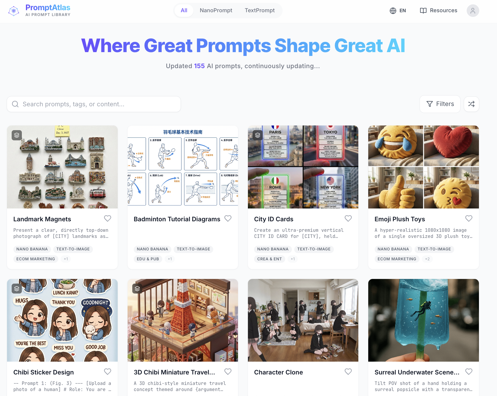
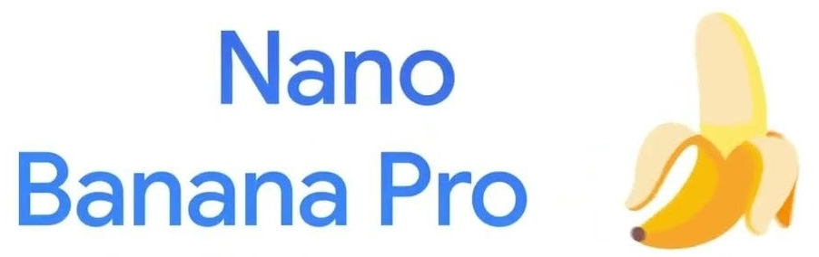
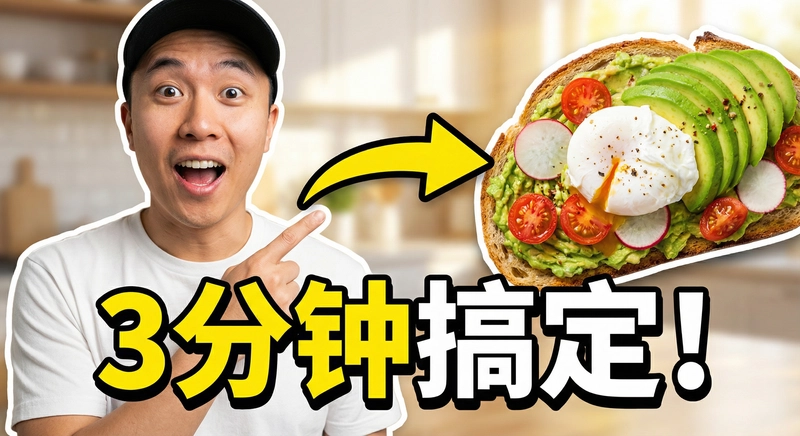
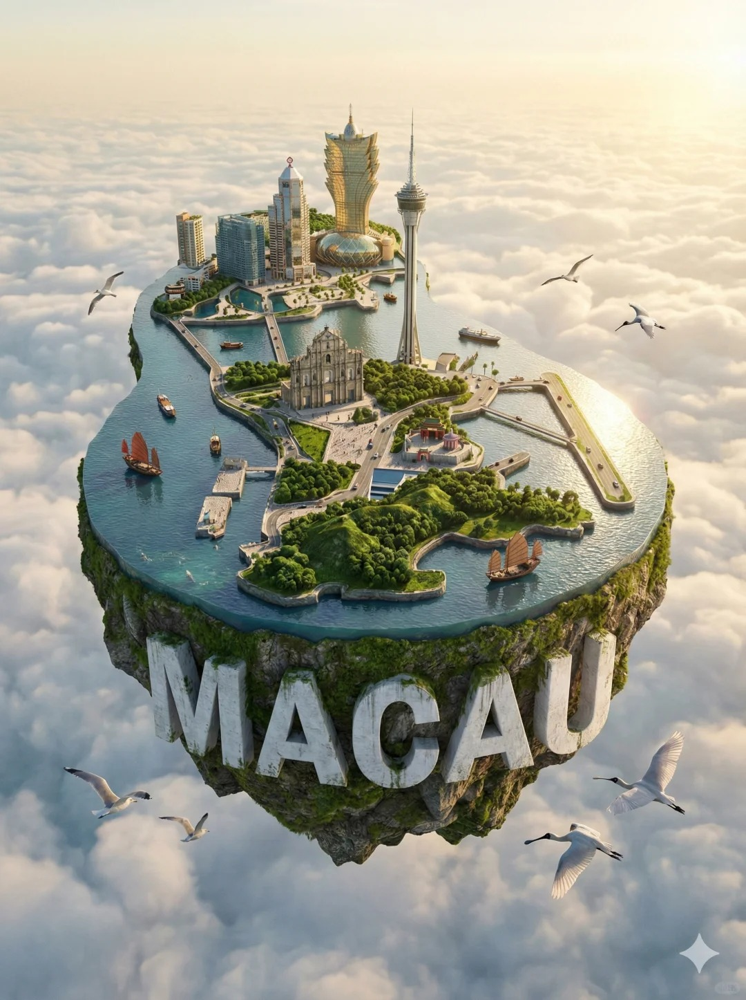
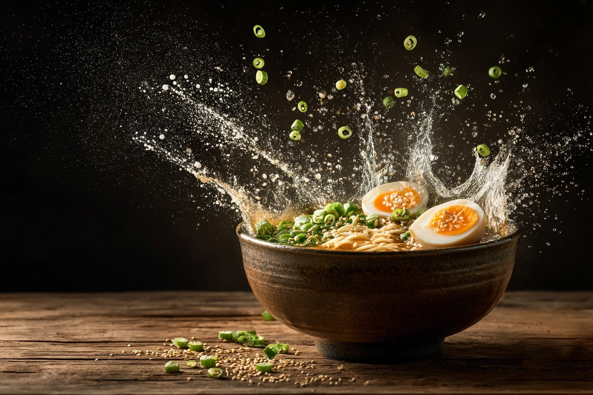
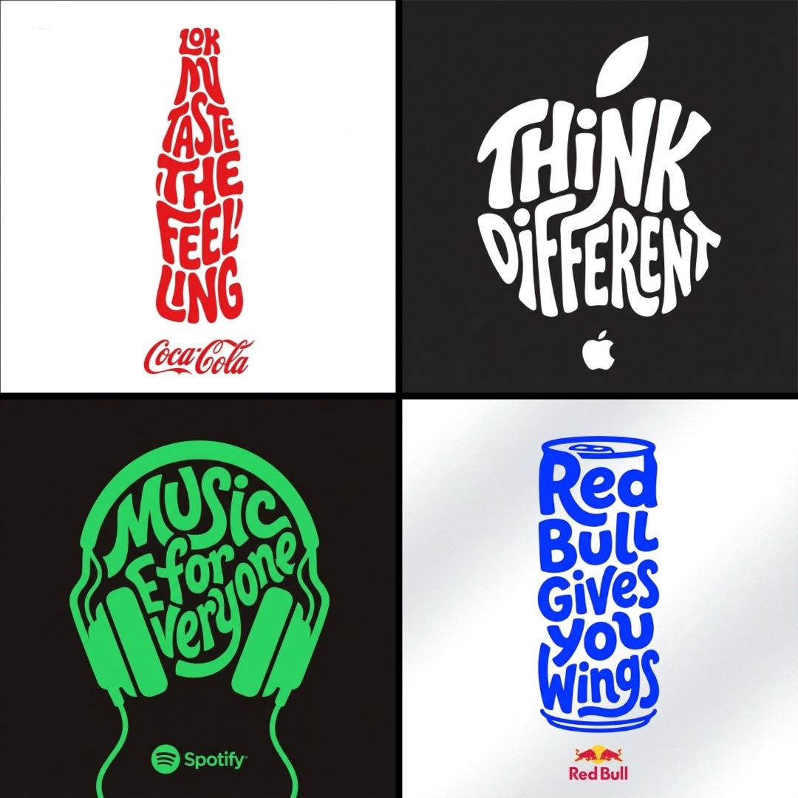
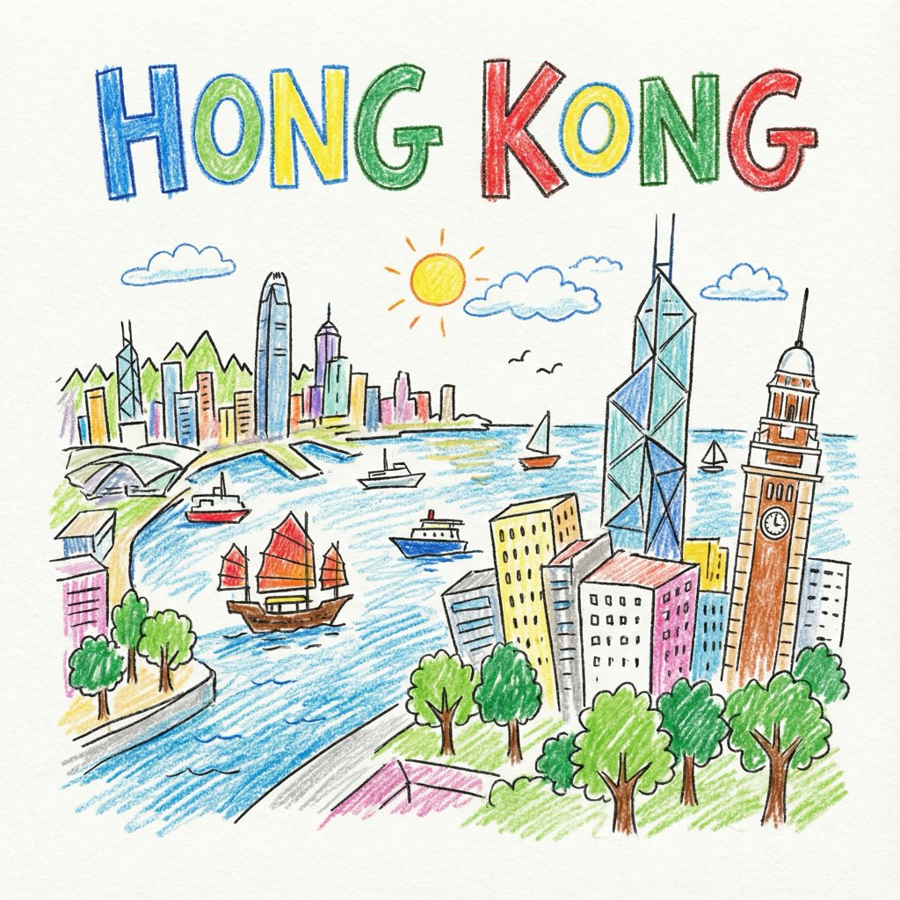
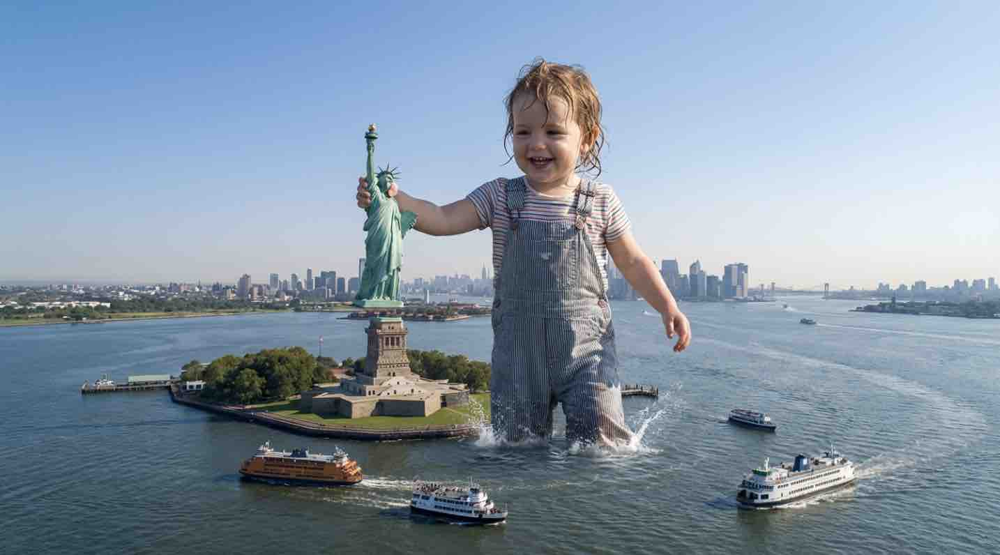
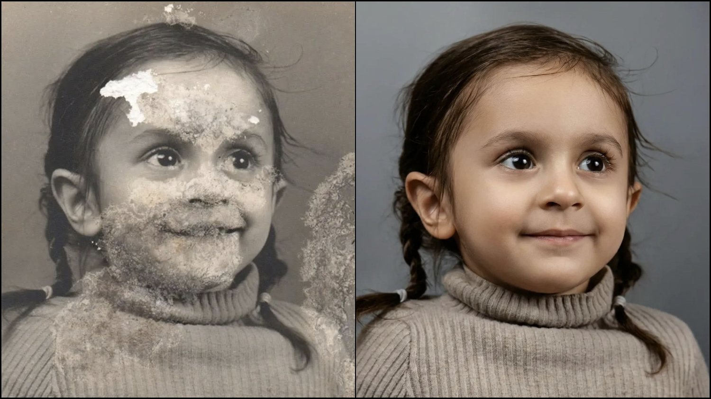
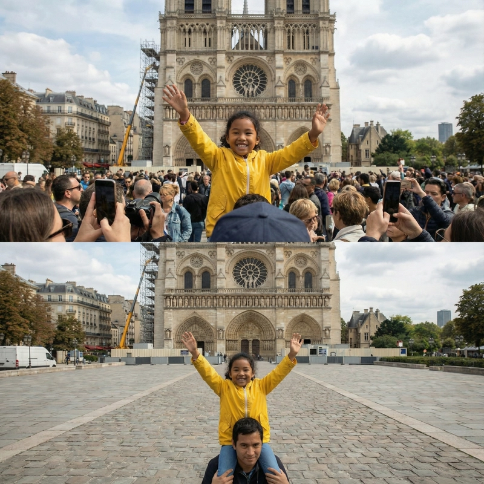

<!-- 

  

 -->

  

  <h1 style="text-align: center;">PromptAtlas – AI Prompt Library</h1>

**<h3 style="text-align: center;">Where Great Prompts Shape Great AI</h3>**

PromptAtlas is a curated, evolving library of high-quality AI prompts designed to help creators, designers, developers, and researchers **create faster, organize better, and generate more inspiring AI results**.

The project aggregates some of the **best, ready-to-use prompts** from the AI community and presents them in a structured, searchable, and reusable way — with previews, metadata, and clear usage guidance.

**Map the Future with Better Prompts.**

Find PromptAtlas website here 👉 https://anynexora.io/promptatlas 

 

## 📖 Table of Contents

- [What Is PromptAtlas?](#-what-is-promptatlas)
- [Who Is This For?](#-who-is-this-for)
- [What’s Included?](#-whats-included)
- [How to Use the Prompt Library](#-how-to-use-the-prompt-library)
- [Learning Resources](#-learning-resources)
- [Platform Compatibility](#-platform-compatibility)
- [Prompt Sources](#-prompt-sources)
- [README Showcase](#-readme-showcase)
- [License](#-license)
- [Acknowledgements](#-acknowledgements)
- [Contributing](#-contributing)

---

## ✨ What Is PromptAtlas?

**PromptAtlas** is a web-based prompt library that brings together:

- Carefully curated **AI image generation prompts** (with a strong focus on *Nano Banana Pro*)
- Practical **text prompt templates** (primarily for *Gemini 3.0*)
- Learning resources and prompt engineering guides
- Visual previews that show *what a prompt can actually produce*

The goal is simple:

> Help people discover, understand, and reuse great prompts — not just collect them.

---

## 🎯 Who Is This For?

PromptAtlas is built for:

- **Content creators** (social media, visual storytelling, branding)
- **Designers** (graphic, UI/UX, illustration, concept art)
- **Developers & AI builders**
- **Researchers and educators**
- Anyone exploring **prompt design as a creative or technical skill**

---

## 📦 What’s Included?

### 🔹 Prompt Library

- ~**200 ready-to-use prompts**, keep updating
- Each prompt is presented as a **card**, including: title, prompt content (English or Chinese), prompt type & category, tags, source, and effect preview image (for image prompts)

### 🔹 Prompt Types

Prompts are organized along **three main dimensions**:

#### 1. Prompt Type
- Text-to-Image  
- Image Editing  
- Text Prompts  

#### 2. Model / Platform
- Nano Banana 
- NotebookLM
- Gemini 3.0    
- ......  

#### 3. Application Category
Based on real usage scenarios:
- Character
- Social Media
- Environment Scene
- E-commerce & Marketing
- UI / UX
- Graphic Design
- Game & Assets
- Education & Publishing
- Creativity & Entertainment
- Science & Research

---

## 🧭 How to Use the Prompt Library

### 1️⃣ Choose a Template
Browse or search prompts by:
- Prompt type
- Model
- Category
- Tags or keywords

Select a template that best matches your goal.

### 2️⃣ Customize the Prompt
- Replace placeholders with your own requirements
- Adjust style, constraints, or parameters as needed
- Refer to the usage notes and examples included with each prompt

### 3️⃣ Generate & Iterate
- Copy the prompt into your target AI platform (Gemini, ChatGPT, Nano Banana Pro, Grok, etc.)
- Review the output and iterate for better results

---

## 📚 Learning Resources

In addition to prompts, PromptAtlas includes:
- Prompt engineering guides
- Best practices and workflows
- Experience sharing and usage manuals
- Tips for improving generation quality and consistency

---

## 🔍 Platform Compatibility

The prompt library is designed to work across multiple AI tools, including:

-          
-  
-      
-      
- 

Prompts may be reused, adapted, or combined across platforms.

---

## 🌐 Prompt Sources

Prompts are collected and curated from the AI community, including:
- X (Twitter)
- Reddit
- Redbook
- WeChat Official Accounts
- Community discussions and shared workflows
- ......

We strive to preserve attribution whenever possible.

---

## 📖 README Showcase

For each major category, the README highlights some best-practice examples. 

### 1. Character 
Prompts focused on realistic portrait, anime/manga/cartoon/film characters, creatures, anthropomorphic, etc. 

#### 1.1 Street Shoot from a Cat's POV

Upload a photo of simple selfie and generate a street shoot from a cat's POV.

 

Prompt content: 

> A cute orange cat taking a dramatic ultra-wide selfie in the foreground, giant perspective effect, playful and dynamic angle. 
> 
> In the background, the man attached in the uploaded reference image (Keep the face of the person 100% accurate from the reference image) in stylish hiphop fashion posing with energetic claws gesture, street-style attitude. 
> 
> Fashion details: oversized jacket, graphic tee, loose pants, chains, modern sneakers. 
> 
> Urban outdoor setting with industrial buildings, blue sky, slightly distorted lens look, vibrant colors, high-fashion editorial vibe, cinematic lighting.

Source: [@NanoBanana_labs](https://x.com/NanoBanana_labs/status/1991846934844174440)

#### 1.2 Black & White Double Exposure

Upload a photo of portrait and generate a black & white double exposure.

 

Prompt content: 

> A double exposure composition in black and white. In the foreground, a woman (like the woman in this photo—realistic) is standing with her back to the camera, her head turned to the left, gazing at the horizon. She is wearing the same dress ensemble, and is standing on a rock in a body of water (sea, lagoon, or lake). In the background, in an overlapping and translucent silhouette, the profile of the same woman's face appears with her eyes closed and head raised, her hair slightly tousled downward. 
>
> The setting is a cloudy or overcast day, with the horizon of the sea or water stretching out. The lighting is diffuse, creating a melancholic and artistic atmosphere. The image has a vintage, grainy, and artistic touch. Face matching.

Source: [@SimplyAnnisa](https://x.com/SimplyAnnisa/status/1977547195512508905)

### 2. Social Media
Prompts focused on thumbnails, avatar/PFP, memes/emojis/stickers, social posts visuals, mobile wallpaper, etc. 

#### 2.1 Pet Emoji Packs

Upload a photo of a pet and generate pet emoji packs.

 

Prompt content: 

> Turn this photo of my [cat] into a funny hand-drawn WeChat sticker.   
> Style: Minimalist ugly-cute line drawing (doodle style). White background.   
> Expression: Exaggerate the animal's expression to look extremely shocked/judgemental/lazy (based on photo).   
> Accessories: Add cute little doodles like sweat drops, question marks, or sparkles around the head.   
> Text: Add handwritten Chinese text at the bottom: '[搞快点 / 累了 / 暗中观察]'. Ensure the text style is messy and funny.  

Source: [@01Founder](https://mp.weixin.qq.com/s/lrYNbs4rGs3KOqewoZ6aNQ)

#### 2.2 Viral Thumbnail

Generate a viral video thumbnail using the person of the upload reference photo.

 

Prompt content: 

> Design a viral video thumbnail using the person from Image 1.   
> Face Consistency: Keep the person's facial features exactly the same as Image 1, but change their expression to look excited and surprised.     
> Action: Pose the person on the left side, pointing their finger towards the right side of the frame.   
> Subject: On the right side, place a high-quality image of a delicious avocado toast.   
> Graphics: Add a bold yellow arrow connecting the person's finger to the toast.   
> Text: Overlay massive, pop-style text in the middle: '3分钟搞定!' (Done in 3 mins!). Use a thick white outline and drop shadow.   
> Background: A blurred, bright kitchen background. High saturation and contrast.   

Source: [@Guillaume Vernade](https://dev.to/googleai/nano-banana-pro-prompting-guide-strategies-1h9n)

### 3. Environment Scene
Prompts focused on landscape, cityscape, architecture, cyberpunk, outdoor/interior, etc. 

#### 3.1 Castle in the Sky

Generate a digital poster of a floating miniature island shaped like [city].

 

Prompt content: 

> Create an ultra-high-definition, hyper-realistic digital poster featuring a miniature island shaped like [CITY] floating above white clouds in the sky. Seamlessly integrate [CITY]'s unique iconic landmarks, natural landscapes (such as forests and mountains), and cultural elements. Carve the name of [CITY] into the terrain using colossal white 3D letters. Add artistic details to enhance realism, including birds specific to the city, cinematic lighting, vibrant colors, an aerial perspective, and sunlight reflection effects. Ultra-high quality, 4K+ resolution. 3:4. CITY: Macao. 

Source: @岸久舞若衣 (Wechat OA)

#### 3.2 Cave Entrance Shape

Generate an image of a landscape, featuring a cave entrance that is shaped exactly like the outline of a [SHAPE].

 

Prompt content: 

> An image of a [TYPE] landscape, featuring a cave entrance that is shaped exactly like the outline of a [SHAPE]. The cave should blend naturally into the rugged terrain of the mountain, with the entrance forming a clear and unmistakable [SHAPE] shape. This [SHAPE] shape should be simple and defined, without intricate details, emphasizing just the overall [SHAPE] outline. The surrounding environment should include [DETAILS], but these elements should not distract from the cave's [SHAPE]-shaped entrance. The lighting in the scene should enhance the visibility and distinctiveness of the [SHAPE]-shaped cave entrance.   
> [TYPE]: fantasy mountainous; [SHAPE]: bird. 

Source: [@umesh_ai](https://x.com/umesh_ai/status/1997265335494595040)

### 4. E-commerce & Marketing
Prompts focused on product photography, try-on, food, figurine, marketing poster, knolling/flat lay, in-context/lifestyle, etc. 

#### 4.1 Food Advertising Photography

Generate an advertising-style food photography.

 

Prompt content: 

> CAdvertising-style food photography of [subject 1] arranged on a rustic table, with [subject 2] floating above in mid-air and a splash of [subject 1] frozen in motion. High-resolution photo manipulation with selective soft focus, clean negative space for text, dramatic lighting, and crisp detail.    
> subject 1: a bowl of ramen; subject 2: green onions and a boiled egg

Source: [@NanoBanana](https://x.com/nanobanana/status/1997460283669831973)

#### 4.2 3D Chibi-style Miniature Concept Store

Generate a 3D chibi-style miniature concept store of Starbucks.

 

Prompt content: 

> 3D chibi-style miniature concept store of {Brand Name}, creatively designed with an exterior inspired by the brand's most iconic product or packaging (such as a giant {brand's core product, e.g., chicken bucket/hamburger/donut/roast duck}).   
> The store features two floors with large glass windows clearly showcasing the cozy and finely decorated interior: {brand's primary color}-themed decor, warm lighting, and busy staff dressed in outfits matching the brand. Adorable tiny figures stroll or sit along the street, surrounded by benches, street lamps, and potted plants, creating a charming urban scene.   
> Rendered in a miniature cityscape style using Cinema 4D, with a blind-box toy aesthetic, rich in details and realism, and bathed in soft lighting that evokes a relaxing afternoon atmosphere. --ar 2:3  
> Brand name: Starbucks

Source: [@dotey](https://x.com/dotey/status/1995190286775881780)

### 5. UI/UX
Prompts focused on App icons, UI illustrations, web assets, hero image, etc. 

#### 5.1 UI Mockup from Wireframe

Generate UI mockup from wireframe.

 

Prompt content: 

> Transform this rough wireframe sketch into a high-fidelity UI design mockups for a mobile app. Design System : Apply a modern, clean aesthetics similar to iOS 18 or Material Design 3. Use rounded corners, soft drop shadows, and a vibrant primary color. Components : Intelligently interpret the sketch: turn scribbles into high-quality placeholder images, convert rough rectangles into proper buttons with gradients, and turn lines into realistic text blocks. Layout: Ensure perfect padding and consistent spacing between elements. Context: Place the design inside a realistic iPhone 16 frame mockups.

Source: @01Founder

### 6. Graphic Design
Prompts focused on logo, poster, name card, packaging, IP mascot, T-shirt Design, wall art, stickers, PPT, illustration, infographics, etc. 

#### 6.1 Typographic Logos

Generate a typographic illustration shaped like a headphone.

 

Prompt content: 

> Create a typographic illustration shaped like a [OBJECT], where the text [BRAND SLOGAN] forms the shape — bold and playful lettering style that fills the entire silhouette — letters adapt fluidly to the curves and contours of the [OBJECT] — [COLOR DESCRIPTION] with [BACKGROUND COLOR] background that enhances the focus on the main shape — include [BRAND] logo positioned below the [OBJECT] — vector-style, clean, high resolution, 1080x1080 pixels, square format.   
> [OBJECT] - Headphones; [BRAND SLOGAN] - Music for everyone; [COLOR DESCRIPTION] - green; [BACKGROUND COLOR] - black; [BRAND] - Spotify  

Source: [@TechieBySA](https://x.com/TechieBySA/status/1995534771158442290)

#### 6.2 Real-Time Finance Data Visualization

Generate a poster for real-Time finance data visualization.

 

Prompt content: 

> Visualize the current stock value of the main tech companies and the current trends. For each add some explanation on what happened recently which could explain that trend.

Source: [@Guillaume Vernade](https://dev.to/googleai/nano-banana-pro-prompting-guide-strategies-1h9n)

#### 6.3 Turn Your Article into a Magazine

Generate a photo of a glossy magazine article with input text.

 

Prompt content: 

> Put this whole text, verbatim, into a photo of a glossy magazine article on a desk, with photos, beautiful typography design, pull quotes and brave formatting. The text: [...the unformatted article]

Source: [@dotey](https://x.com/fofrAI/status/1991530971800182929)

### 7. Game & Assets
Prompts focused on game assets, textures, character design, sprite, chibi isometric 3D asset, etc. 

#### 7.1 Game Sprites

 

Prompt content: 

> Sprite sheet of a woman doing a backflip on a drone, 3x3 grid, sequence, frame by frame animation, square aspect ratio. Follow the structure of the attached reference image exactly.  

Source: [@Guillaume Vernade](https://dev.to/googleai/nano-banana-pro-prompting-guide-strategies-1h9n)

#### 7.2 3D Isometric Colored Illustration

Generate a 3D isometric colored illustration of working space.

 

Prompt content: 

> Based on you know about me, generate a 3D isometric colored illustration of me working from home, filled with various interior details. The visual style should be rounded, polished, and playful. --ar 1:1   
> [Additional details: a bichon frise and 3 monitors]  

Source: [@dotey](https://x.com/dotey/status/1995944319677554985)

### 8. Education & Publishing
Prompts focused on education graphics, knowledge infographics, data viz, cover image, children's book illustration, coloring pages, culture history, math solver, textbook diagrams, etc. 

#### 8.1 Tokyo Pop-up Atlas

Generate a pop-up miniature of Tokyo rises from a laser-cut slit across the Asia map.

 

Prompt content: 

> An open hardcover atlas lies flat; a precision pop-up miniature of Tokyo rises from a laser-cut slit across the Asia map. Landmarks Shibuya Crossing, Tokyo Tower, and Sensō-ji Temple interlock with folded paper struts. White 3D ‘TOKYO’ emboss/deboss blends into pop-up platforms. Softboxes 45°/120°, polarized reflections, dynamic low angle, razor-sharp fold edges.  

Source: [@Gdgtify](https://x.com/Gdgtify/status/1995886174058283387)

#### 8.2 Kid-Drawn Cities

Generate a colorful crayon and colored-pencil drawing of a city.

 

Prompt content: 

> A neat, colorful crayon and colored-pencil drawing of [CITY], featuring iconic landmarks, trees, and a bright sky. The style is slightly more polished than a typical child's drawing — clean but still playful lines, uneven perspective, and charming imperfections. The word “CITY” is written in large, multicolored crayon letters at the top of the page, matching the city’s vibe. White textured paper background, 1080x1080. CITY: HongKong

Source: [@TechieBySA](https://x.com/TechieBySA/status/1996671677712003331)

### 9. Creativity & Entertainment
Prompts focused on creative works, art photography, entertainment, etc. 

#### 9.1 Surreal Underwater Office

Generate a surreal, dreamlike photograph of a complete office environment submerged deep underwater. 

 

Prompt content: 

> A surreal, dreamlike photograph of a complete office environment submerged deep underwater. An elegant Asian businesswoman in a sharp, tailored suit sits perfectly composed at a floating mahogany desk, typing on a laptop that glows blue. Her hair and papers float weightlessly around her head like seaweed. Schools of colorful tropical fish swim nonchalantly through the scene. Sunlight filters down from the surface far above, creating shimmering, rippling caustic light patterns on her face and the sandy office floor. The mood is eerie, calm, and impossibly beautiful.

Source: [@johnAGI168](https://x.com/johnAGI168/status/1996825429584560244)

#### 9.2 Giant People/Animals

Generate a giant people or animals positioned in the urban scenerio.

 

Prompt content: 

> A highly detailed, photorealistic [drone shot photograph looking level] showing a colossal smiling toddler positioned in [New York Harbor at the Statue of Liberty]. The giant is standing in the water, it has picked up and removed the statue of liberty from it's base and it's holding the statue of liberty. To establish the immense scale, tiny [ferries and Statue Cruises boats navigating around her legs] are visible near her [waist in the water]. The lighting is [clear blue sky, late morning].

Source: [@MrDavids1](https://x.com/MrDavids1/status/1997581641892446293)

### 10. Science Research
Prompts focused on academic illustration, science research, etc. 

#### 10.1 Loss Landscape Scientific Illustration

Generate professional scientific illustration for a top-tier machine learning academic paper. 

 

Prompt content: 

> A professional scientific illustration for a top-tier machine learning academic paper, figure view. A complex, highly non-convex 3D loss landscape surface rendered with a scientific color scheme (matplotlib 'magma' or 'parula' style, transitioning from deep purple blue valleys to bright yellow orange peaks). The surface features rugged terrain, saddle points, wide plateaus, and multiple sharp local minima, with one clearly deepest global minimum. Two distinct optimization trajectory lines with glowing arrows show the path of descent: one "SGD" trajectory (a noisy, oscillating red line getting stuck in a local valley) and one "Adam" trajectory (a smoother, accelerated bright cyan line finding the global minimum). The figure includes elegant wireframe axis box, scientific axis labels ($w_1$, $w_2$, Loss $\mathcal{L}$), and a clean legend. Vector graphics aesthetic, clean lines, high resolution, 4k render, isometric camera angle.

Source: [@Bili-Sakura](https://www.xiaohongshu.com/explore/693d2055000000000d00d2d0?xsec_token=ABN7wTk77i66aiW_KAjkOQmh_md1wddX2feN90KYgUktU=&xsec_source=pc_user)

### 11. Image Editing
Prompts focused on inpainting, outpainting, object removal, object editing, colorization, style transfer, restoration, portrait editing, etc. 

#### 11.1 Restoration of Damaged Old Photos

Upload an old, damaged photo and repair it.

 

Prompt content: 

> Ultra high-resolution photo enhancement and upscaling. Transform this image into a crystal-clear, detailed, realistic quality. Remove noise, blur, grain, scratches, and compression artifacts. Sharpen all important details while keeping natural texture. Restore faded colors, balance exposure, increase clarity and contrast. Improve skin tone and facial features naturally, without altering identity. Repair old damage or missing details. Produce a clean, vibrant, ultra-realistic result with soft cinematic lighting and perfect sharpness. Output resolution: 8K / 16K ultra HD.  

Source: [@ShreyaYadav___](https://x.com/ShreyaYadav___/status/1997603246299636014)

#### 11.2 Object Removal & In-painting

Remove the tourists from the background of the upload photo.

 

Prompt content: 

> Remove all the tourists/people in the background behind the main subject. Intelligent Fill: Replace them with realistic background elements that logically fit the scene (e.g., extend the cobblestone pavement, empty park benches, or grass textures). Consistency: Ensure no blurry artifacts or 'smudges' remain. The filled area must have the same grain, focus depth, and lighting as the rest of the photo.    

Source: [@Guillaume Vernade](https://dev.to/googleai/nano-banana-pro-prompting-guide-strategies-1h9n)

---

## 📜 License

This project is released under the **MIT License**.  
You are free to use, modify, and distribute it with proper attribution.

---

## 🙏 Acknowledgements

Special thanks to:

- Everyone who contributed ideas, prompts, and improvements
- The AI / ML community for continuous inspiration and feedback
- Open-source projects that inspired this library
- All creators who shared their prompt cases publicly

> Some examples may not originate from the original authors.  
> If any content causes concern, please contact us and we will update or remove it promptly.

PromptAtlas cannot cover every possible use case.  
If you discover interesting prompts or creative workflows, **we warmly welcome contributions and suggestions**.

---

## 🚀 Contributing

Contributions, improvements, and new prompt ideas are welcome.  
Feel free to open an issue or submit a pull request.

---

**PromptAtlas**  
*Where Great Prompts Shape Great AI*
